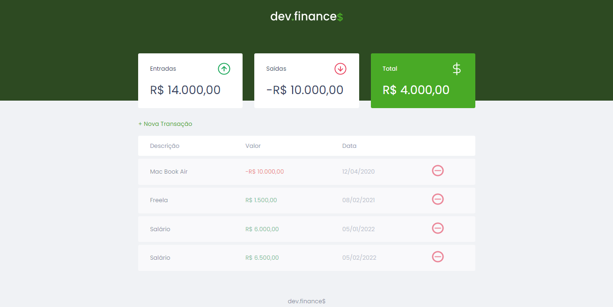
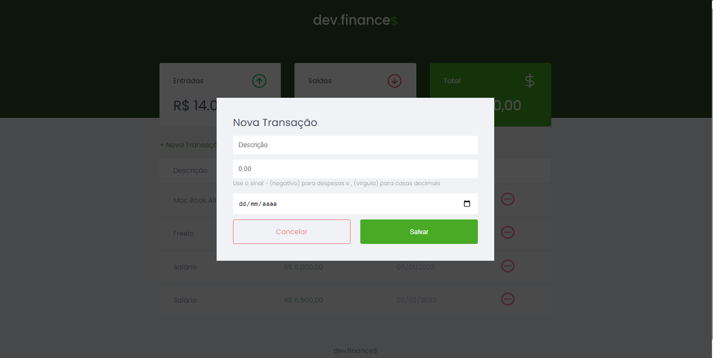

# Dev.Finance




> Projeto do curso Discover da Rocketseat, onde tem como objetivo efetuar um controle de despesas, podendo adicionar e excluir uma transação.

## Técnologias utilizadas

- HTML5
- CSS3
- JavaScript

## Futuras melhorias

- Migrar o projeto para reactJS
- Usar TypeScript
- Estilizar com Styled-components

## 🚀 Instalando Dev.Finance

Para instalar o projeto, siga estas etapas:

- Crie uma pasta chamada DevFinance
- Faça um clone desse repositório na pasta criada

```
git clone https://github.com/MatheusAbreuTech/Dev.Finance.git
```

## ☕ Usando Dev.Finance

Para usar o projeto, basta abrir o arquivo index.html em um browser

[⬆ Voltar ao topo](#Dev.Finance)<br>
